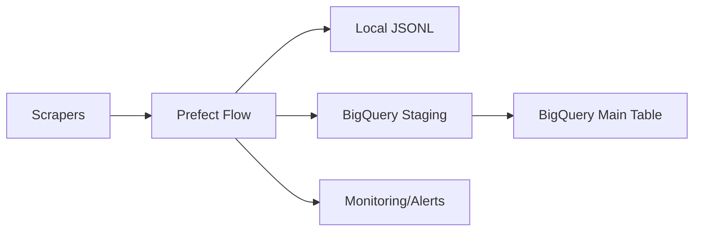

# Code Review & Suggestions - Scraper de Filmes

**Project Type:** Junior-Level Data Engineering Project
**Review Date:** 2025-11-18
**Reviewer:** Senior Data Engineer

---

## 📊 Executive Summary

This is a well-structured web scraping project that demonstrates good understanding of modern Python development practices. The project successfully implements two movie scrapers with BigQuery integration and Prefect orchestration. Overall code quality is **good** with room for improvement in several areas.

**Strengths:**
- ✅ Clean project structure with separated concerns
- ✅ Good use of Pydantic for data validation
- ✅ Proper use of orchestration (Prefect)
- ✅ BigQuery integration with staging/merge pattern
- ✅ Shared utilities to reduce code duplication
- ✅ Documentation is comprehensive

**Areas for Improvement:**
- ⚠️ Error handling could be more robust
- ⚠️ Missing comprehensive logging strategy
- ⚠️ Test coverage is incomplete
- ⚠️ Some configuration management issues
- ⚠️ Missing data quality checks

---

## 🎯 Priority Recommendations

### 🔴 High Priority (Do First)

#### 1. Fix Dependency Management Inconsistency
**Issue:** You have both `pyproject.toml` and `requirements.txt` with different dependencies.

**Current State:**
- `pyproject.toml` has comprehensive dependencies
- `requirements.txt` has outdated/different dependencies (Scrapy, dateparser not used)

**Recommendation:**
```bash
# Remove requirements.txt entirely
rm requirements.txt

# Use only pyproject.toml with uv
# This is already your current workflow, so just clean up the old file
```

**Impact:** Prevents confusion and dependency conflicts.

---

#### 2. Add Proper Logging Configuration
**Issue:** Using `print()` statements in `comando_torrents` parser, while `gratis_torrent` uses `loguru`.

**Current Code (comando_torrents/parser.py):**
```python
print(f"Error: Failed to fetch page from {link}")
print(f"Details: {error}")
```

**Recommended:**
```python
from loguru import logger

logger.error(f"Failed to fetch page from {link}: {error}")
logger.debug(f"Details: {error}")
```

**Action Items:**
- [x] Replace all `print()` statements with `logger` calls
- [x] Create a centralized logging configuration in `scrapers/utils/logging_config.py`
- [x] Set up log levels (DEBUG, INFO, WARNING, ERROR)
- [x] Add log file rotation

**Example logging config:**
```python
# scrapers/utils/logging_config.py
from loguru import logger
import sys

def setup_logging(level="INFO", log_file="scraper.log"):
    logger.remove()  # Remove default handler

    # Console handler
    logger.add(
        sys.stderr,
        format="<green>{time:YYYY-MM-DD HH:mm:ss}</green> | <level>{level: <8}</level> | <cyan>{name}</cyan>:<cyan>{function}</cyan> - <level>{message}</level>",
        level=level
    )

    # File handler with rotation
    logger.add(
        log_file,
        rotation="10 MB",
        retention="1 week",
        compression="zip",
        level="DEBUG"
    )

    return logger
```

---

#### 3. Improve Error Handling and Retry Logic ✅
**Status:** COMPLETED (2025-11-18)

**Issue:** Silent failures and inconsistent error handling across scrapers.

**Implementation:**
- ✅ Added `tenacity` library for retry logic
- ✅ Created custom exceptions in `scrapers/utils/exceptions.py`
- ✅ Added retry decorators with exponential backoff (3 attempts, 4-10s wait)
- ✅ Updated both `gratis_torrent` and `comando_torrents` scrapers
- ✅ Improved error messages with exception chaining and detailed logging

**Current Code (gratis_torrent/scraper.py):**
```python
def scrape_movie_details(url: str) -> Movie | None:
    soup = fetch_page(url)
    if not soup:
        logger.warning(f"Skipping {url} - could not fetch page")
        return None  # Silent failure
```

**Recommended:**
```python
from typing import Optional
from tenacity import retry, stop_after_attempt, wait_exponential

@retry(
    stop=stop_after_attempt(3),
    wait=wait_exponential(multiplier=1, min=4, max=10),
    reraise=True
)
def scrape_movie_details(url: str) -> Optional[Movie]:
    """
    Scrape details for a single movie with retry logic.

    Args:
        url: URL of the movie page

    Returns:
        Movie object or None if scraping fails after retries

    Raises:
        ScraperException: If critical error occurs
    """
    try:
        soup = fetch_page(url)
        if not soup:
            raise ScraperException(f"Failed to fetch page: {url}")

        movie = parse_movie_page(soup, url)
        if not movie:
            logger.warning(f"No movie data extracted from {url}")
            return None

        return movie

    except Exception as e:
        logger.error(f"Error scraping {url}: {e}", exc_info=True)
        raise ScraperException(f"Failed to scrape {url}") from e
```

**Add custom exceptions:**
```python
# scrapers/utils/exceptions.py
class ScraperException(Exception):
    """Base exception for scraper errors"""
    pass

class ParsingException(ScraperException):
    """Raised when parsing fails"""
    pass

class ValidationException(ScraperException):
    """Raised when data validation fails"""
    pass
```

---

#### 4. Add Environment Variable Validation
**Issue:** No validation that required environment variables are set.

**Current Code (gratis_torrent/config.py):**
```python
GCP_PROJECT_ID: str = os.getenv("GCP_PROJECT_ID", "galvanic-flame-384620")
```

**Recommended:**
```python
from pydantic_settings import BaseSettings
from pydantic import Field, validator

class Config(BaseSettings):
    """Configuration settings with validation."""

    # GCP Settings
    GCP_PROJECT_ID: str = Field(..., description="Google Cloud Project ID")
    DATASET_ID: str = Field(default="movies_raw", description="BigQuery dataset")
    TABLE_ID: str = Field(default="filmes", description="Main table name")
    STAGING_TABLE_ID: str = Field(default="stg_filmes", description="Staging table")
    LOCATION: str = Field(default="US", description="BigQuery location")

    # Scraper Settings
    BASE_URL: str = Field(
        default="https://gratistorrent.com/lancamentos/",
        description="Base URL for scraping"
    )
    REQUEST_TIMEOUT: int = Field(default=40, ge=1, le=300)

    # Email Settings (optional)
    EMAIL: str | None = None
    EMAIL_PW: str | None = None

    class Config:
        env_file = ".env"
        env_file_encoding = "utf-8"
        case_sensitive = True

    @validator("GCP_PROJECT_ID")
    def validate_project_id(cls, v):
        if not v or v == "your-project-id":
            raise ValueError("GCP_PROJECT_ID must be set to a valid project ID")
        return v
```

---

### 🟡 Medium Priority

#### 5. Improve Test Coverage
**Issue:** Tests exist but have several problems:
- Custom test runner instead of using pytest properly
- Tests reference functions that don't exist (`safe_convert_float`, `safe_convert_int`)
- No integration tests
- No mocking of external services

**Current Test Issues (test_suite.py:196-213):**
```python
from scrapers.gratis_torrent.parser import (
    clean_genre,
    safe_convert_float,  # ❌ Doesn't exist
    safe_convert_int,    # ❌ Doesn't exist
    extract_regex_field,
)
```

**Recommended Structure:**
```
scrapers/tests/
├── __init__.py
├── conftest.py                    # Pytest fixtures
├── unit/
│   ├── test_parse_utils.py       # Test parse_utils functions
│   ├── test_models.py             # Test Pydantic models
│   ├── test_gratis_parser.py     # Test gratis_torrent parser
│   └── test_comando_parser.py    # Test comando_torrents parser
├── integration/
│   ├── test_gratis_flow.py       # Test full gratis flow
│   └── test_comando_flow.py      # Test full comando flow
└── fixtures/
    ├── sample_gratis.html         # Sample HTML for testing
    └── sample_comando.html
```

**Example Proper Test:**
```python
# tests/unit/test_parse_utils.py
import pytest
from scrapers.utils.parse_utils import parse_rating, parse_year, parse_int

class TestParseRating:
    """Test parse_rating function."""

    def test_valid_rating(self):
        assert parse_rating("8.5") == 8.5
        assert parse_rating("7,5") == 7.5  # Comma separator

    def test_invalid_rating(self):
        assert parse_rating("invalid") is None
        assert parse_rating("") is None
        assert parse_rating(None) is None

    @pytest.mark.parametrize("input,expected", [
        ("9.0", 9.0),
        ("10", 10.0),
        ("0.5", 0.5),
    ])
    def test_rating_variations(self, input, expected):
        assert parse_rating(input) == expected

# tests/conftest.py
import pytest
from pathlib import Path

@pytest.fixture
def sample_gratis_html():
    """Load sample HTML for gratis_torrent tests."""
    fixture_path = Path(__file__).parent / "fixtures" / "sample_gratis.html"
    return fixture_path.read_text()

@pytest.fixture
def mock_movie_data():
    """Sample movie data for testing."""
    return {
        "titulo_dublado": "Matrix",
        "titulo_original": "The Matrix",
        "imdb": 8.7,
        "ano": 1999,
        "genero": "Action, Sci-Fi",
        "tamanho": "2.5",
        "duracao_minutos": 136,
        "qualidade_video": 10.0,
        "qualidade": "1080p BluRay",
        "dublado": True,
        "sinopse": "A hacker discovers reality.",
        "link": "https://example.com/matrix",
    }
```

**Run tests properly:**
```bash
# Add to pyproject.toml
[tool.pytest.ini_options]
pythonpath = ["."]
testpaths = ["scrapers/tests"]
python_files = ["test_*.py"]
python_classes = ["Test*"]
python_functions = ["test_*"]
addopts = [
    "-v",
    "--cov=scrapers",
    "--cov-report=html",
    "--cov-report=term-missing",
]

# Run tests
uv run pytest
```

---

#### 6. Add Data Quality Checks
**Issue:** No validation that scraped data meets quality standards.

**Recommended:**
```python
# scrapers/utils/data_quality.py
from typing import List
from loguru import logger
from scrapers.utils.models import Movie

class DataQualityChecker:
    """Validate scraped data quality."""

    def __init__(self, min_fields_filled: float = 0.7):
        self.min_fields_filled = min_fields_filled
        self.quality_issues = []

    def check_movie(self, movie: Movie) -> bool:
        """
        Check if a movie meets quality standards.

        Returns:
            True if movie passes quality checks
        """
        issues = []

        # Check required fields
        if not movie.titulo_dublado and not movie.titulo_original:
            issues.append("Missing both titles")

        if not movie.link:
            issues.append("Missing link")

        # Check field completeness
        total_fields = len(movie.model_fields)
        filled_fields = sum(1 for field, value in movie.model_dump().items()
                           if value is not None)
        completeness = filled_fields / total_fields

        if completeness < self.min_fields_filled:
            issues.append(f"Low completeness: {completeness:.1%}")

        # Check data validity
        if movie.ano and (movie.ano < 1888 or movie.ano > 2030):
            issues.append(f"Invalid year: {movie.ano}")

        if movie.imdb and (movie.imdb < 0 or movie.imdb > 10):
            issues.append(f"Invalid IMDB: {movie.imdb}")

        if issues:
            self.quality_issues.append({
                "link": movie.link,
                "issues": issues
            })
            logger.warning(f"Quality issues for {movie.link}: {', '.join(issues)}")
            return False

        return True

    def check_batch(self, movies: List[Movie]) -> dict:
        """
        Check quality of a batch of movies.

        Returns:
            Dictionary with quality metrics
        """
        total = len(movies)
        passed = sum(1 for movie in movies if self.check_movie(movie))

        return {
            "total_movies": total,
            "passed_quality": passed,
            "failed_quality": total - passed,
            "pass_rate": passed / total if total > 0 else 0,
            "issues": self.quality_issues
        }

# Use in flow
def scrape_all_movies() -> list[dict]:
    links = scrape_movie_links()
    movies_list = []
    quality_checker = DataQualityChecker(min_fields_filled=0.7)

    for link in links:
        movie = scrape_movie_details(link)
        if movie and quality_checker.check_movie(movie):
            movies_list.append(movie.model_dump())

    # Log quality report
    report = quality_checker.check_batch([Movie(**m) for m in movies_list])
    logger.info(f"Quality Report: {report['pass_rate']:.1%} pass rate")

    return movies_list
```

---

#### 7. Improve BigQuery Error Handling ✅
**Status:** COMPLETED (2025-11-18)

**Issue:** BigQuery operations could fail silently or with unclear errors.

**Implementation:**
- ✅ Added `BigQueryException` to `scrapers/utils/exceptions.py`
- ✅ Updated all BigQuery operations with comprehensive error handling
- ✅ Added timeout configuration (300 seconds) to all long-running operations
- ✅ Improved logging with detailed context for all operations
- ✅ Changed `load_data_to_staging()` return type to `int` (returns row count)
- ✅ All exceptions use proper error chaining with `from e`

**Current Code (bigquery_client.py):**
```python
def load_data_to_staging(client: bigquery.Client, data: list[dict]):
    # No error handling for load job failures
    job = client.load_table_from_json(...)
```

**Recommended:**
```python
from google.cloud import bigquery
from google.cloud.exceptions import GoogleCloudError
from loguru import logger

def load_data_to_staging(client: bigquery.Client, data: list[dict]) -> int:
    """
    Load movie data into BigQuery staging table.

    Returns:
        Number of rows loaded

    Raises:
        BigQueryException: If load fails
    """
    if not data:
        logger.warning("No data to load to staging")
        return 0

    table_id = Config.get_full_table_id(Config.STAGING_TABLE_ID)

    try:
        job_config = bigquery.LoadJobConfig(
            schema=load_schema(),
            write_disposition=bigquery.WriteDisposition.WRITE_TRUNCATE,
        )

        logger.info(f"Loading {len(data)} rows to {table_id}")
        job = client.load_table_from_json(data, table_id, job_config=job_config)

        # Wait for job to complete
        result = job.result(timeout=300)  # 5 minute timeout

        if job.errors:
            logger.error(f"Load job had errors: {job.errors}")
            raise BigQueryException(f"Load failed with errors: {job.errors}")

        rows_loaded = result.output_rows
        logger.info(f"Successfully loaded {rows_loaded} rows to staging")
        return rows_loaded

    except GoogleCloudError as e:
        logger.error(f"BigQuery error loading to staging: {e}")
        raise BigQueryException(f"Failed to load to staging: {e}") from e
    except Exception as e:
        logger.error(f"Unexpected error loading to staging: {e}")
        raise BigQueryException(f"Unexpected load failure: {e}") from e

class BigQueryException(Exception):
    """Exception for BigQuery operations."""
    pass
```

---

---

#### 8. Add Rate Limiting ✅
**Status:** COMPLETED (2025-11-18)

**Issue:** No rate limiting could get IP blocked.

**Implementation:**
- ✅ Created `scrapers/utils/rate_limiter.py` with `RateLimiter` class and decorator
- ✅ Applied `@rate_limit` decorator to both scrapers' fetch functions
- ✅ Configured to 2 requests per second (0.5s minimum interval)
- ✅ Verified correct timing enforcement with unit tests

**Recommended:**
```python
# scrapers/utils/rate_limiter.py
import time
from functools import wraps
from loguru import logger

class RateLimiter:
    """Simple rate limiter for HTTP requests."""

    def __init__(self, calls_per_second: float = 1.0):
        self.min_interval = 1.0 / calls_per_second
        self.last_call = 0.0

    def wait(self):
        """Wait if necessary to respect rate limit."""
        elapsed = time.time() - self.last_call
        if elapsed < self.min_interval:
            sleep_time = self.min_interval - elapsed
            logger.debug(f"Rate limiting: sleeping {sleep_time:.2f}s")
            time.sleep(sleep_time)
        self.last_call = time.time()

def rate_limit(calls_per_second: float = 1.0):
    """Decorator to rate limit function calls."""
    limiter = RateLimiter(calls_per_second)

    def decorator(func):
        @wraps(func)
        def wrapper(*args, **kwargs):
            limiter.wait()
            return func(*args, **kwargs)
        return wrapper
    return decorator

# Usage in http_client.py
@rate_limit(calls_per_second=2.0)  # Max 2 requests per second
def fetch_page(url: str, timeout: int = Config.REQUEST_TIMEOUT) -> BeautifulSoup | None:
    try:
        response = requests.get(url, timeout=timeout)
        response.raise_for_status()
        return BeautifulSoup(response.text, "html.parser")
    except requests.RequestException as e:
        logger.error(f"Failed to fetch {url}: {e}")
        return None
```


---

### 🟢 Low Priority (Nice to Have)

#### 9. Add Type Hints Everywhere
**Issue:** Some functions lack type hints.

**Recommendation:**
- Run `mypy` to find missing type hints
- Add type hints to all functions
- Enable strict mypy checking

```bash
# Add to pyproject.toml
[tool.mypy]
python_version = "3.11"
warn_return_any = true
warn_unused_configs = true
disallow_untyped_defs = true
disallow_any_generics = true
check_untyped_defs = true
no_implicit_optional = true
warn_redundant_casts = true
warn_unused_ignores = true
warn_no_return = true
strict_equality = true

# Run mypy
uv run mypy scrapers/
```

---

#### 10. Add Pre-commit Hooks
**Recommendation:**
```yaml
# .pre-commit-config.yaml
repos:
  - repo: https://github.com/pre-commit/pre-commit-hooks
    rev: v4.5.0
    hooks:
      - id: trailing-whitespace
      - id: end-of-file-fixer
      - id: check-yaml
      - id: check-added-large-files
      - id: check-json
      - id: check-toml
      - id: detect-private-key

  - repo: https://github.com/astral-sh/ruff-pre-commit
    rev: v0.1.9
    hooks:
      - id: ruff
        args: [--fix, --exit-non-zero-on-fix]
      - id: ruff-format

  - repo: https://github.com/pre-commit/mirrors-mypy
    rev: v1.8.0
    hooks:
      - id: mypy
        additional_dependencies: [types-requests]

# Install
uv pip install pre-commit
pre-commit install
```

---

#### 11. Add Monitoring and Alerting
**Recommendation:**
```python
# scrapers/utils/monitoring.py
from datetime import datetime
from loguru import logger
from scrapers.utils.send_mail import send_email

class ScraperMonitor:
    """Monitor scraper health and send alerts."""

    def __init__(self, min_movies_threshold: int = 10):
        self.min_movies_threshold = min_movies_threshold
        self.start_time = datetime.now()

    def check_results(self, movies_scraped: int, rows_loaded: int):
        """Check if scraping results are healthy."""
        issues = []

        if movies_scraped < self.min_movies_threshold:
            issues.append(f"Low movie count: {movies_scraped} (expected >= {self.min_movies_threshold})")

        if rows_loaded == 0 and movies_scraped > 0:
            issues.append(f"No rows loaded despite scraping {movies_scraped} movies")

        load_rate = rows_loaded / movies_scraped if movies_scraped > 0 else 0
        if load_rate < 0.5:
            issues.append(f"Low load rate: {load_rate:.1%}")

        if issues:
            self.send_alert(issues, movies_scraped, rows_loaded)
            return False

        return True

    def send_alert(self, issues: list[str], movies_scraped: int, rows_loaded: int):
        """Send alert email about scraping issues."""
        duration = (datetime.now() - self.start_time).total_seconds()

        subject = "🚨 Scraper Alert - Issues Detected"
        body = f"""
        Scraper completed with issues:

        Issues:
        {chr(10).join(f"- {issue}" for issue in issues)}

        Stats:
        - Movies Scraped: {movies_scraped}
        - Rows Loaded: {rows_loaded}
        - Duration: {duration:.1f}s
        - Timestamp: {datetime.now().isoformat()}
        """

        try:
            send_email(subject, body)
            logger.info("Alert email sent")
        except Exception as e:
            logger.error(f"Failed to send alert email: {e}")

# Use in flow
def gratis_torrent_flow() -> dict:
    monitor = ScraperMonitor(min_movies_threshold=10)

    movies = scrape_movies_task()
    # ... save to disk ...
    rows_affected = load_to_bigquery_task(Config.MOVIES_JSON_PATH)

    result = {
        "movies_scraped": len(movies),
        "rows_loaded": rows_affected,
    }

    monitor.check_results(len(movies), rows_affected)

    return result
```

---

#### 12. Improve Documentation
**Current State:** Good README and docs, but could be better.

**Recommendations:**

1. **Add docstring examples:**
```python
def parse_rating(rating_text: str | None) -> float | None:
    """
    Convert rating text to float.

    Args:
        rating_text: String representation of rating (e.g., "8.5" or "7,5")

    Returns:
        Float rating or None if invalid

    Examples:
        >>> parse_rating("8.5")
        8.5
        >>> parse_rating("7,5")
        7.5
        >>> parse_rating("invalid")
        None
    """
```

2. **Add architecture diagram to README:**
```markdown
## Architecture


```

3. **Add troubleshooting section:**
```markdown
## Common Issues

### "No movies scraped"
- Check if website structure changed
- Verify CSS selectors are still valid
- Check network connectivity

### "BigQuery permission denied"
- Run `gcloud auth application-default login`
- Verify GCP_PROJECT_ID in .env
```

---

## 📁 File-Specific Issues

### `.gitignore`
**Issue:** Ignoring all JSON files but need schema.json

**Current:**
```gitignore
*.json
!**/schema.json
```

**Better:**
```gitignore
# Data files
*.jsonl
movies.json
comando_cache/
movie_cache/

# Keep schema files
!schema.json
!**/schema.json

# Python
__pycache__/
*.pyc
*.pyo
*.pyd
.Python
*.so
*.egg
*.egg-info/
dist/
build/
.pytest_cache/
.mypy_cache/
.ruff_cache/
.coverage
htmlcov/

# Environment
.env
.venv/
venv/
ENV/

# IDE
.vscode/
.idea/
*.swp
*.swo
*~

# OS
.DS_Store
Thumbs.db

# Logs
*.log
logs/

# Database
*.db
*.sqlite
*.sqlite3
```

---

### `prefect.yaml`
**Issue:** Hardcoded repository and incorrect entrypoint path

**Current:**
```yaml
pull:
- prefect.deployments.steps.git_clone:
    repository: git@github.com:levyvix/scraper-filmes.git
    branch: main

entrypoint: src/scrapers/gratis_torrent/flow.py:gratis_torrent_flow
```

**Issues:**
1. Entrypoint path has `src/` but project doesn't have src directory
2. Repository is hardcoded

**Fix:**
```yaml
pull:
- prefect.deployments.steps.git_clone:
    repository: git@github.com:levyvix/scraper-filmes.git
    branch: main

deployments:
- name: gratis-torrent
  entrypoint: scrapers/gratis_torrent/flow.py:gratis_torrent_flow  # Fixed path
  # ... rest of config
```

---

### `requirements.txt`
**Issue:** Outdated and conflicts with pyproject.toml

**Action:** Delete this file entirely. You're using `uv` with `pyproject.toml`.

---

### `scrapers/utils/send_mail.py`
**Issue:** No error handling, credentials in env vars

**Current:** (assumed based on common patterns)

**Recommended:**
```python
import os
from loguru import logger
import yagmail

def send_email(subject: str, body: str, to: str | None = None) -> bool:
    """
    Send email notification.

    Args:
        subject: Email subject
        body: Email body
        to: Recipient email (uses EMAIL env var if not provided)

    Returns:
        True if email sent successfully
    """
    email = os.getenv("EMAIL")
    email_pw = os.getenv("EMAIL_PW")

    if not email or not email_pw:
        logger.warning("Email credentials not configured, skipping email")
        return False

    recipient = to or email

    try:
        yag = yagmail.SMTP(email, email_pw)
        yag.send(
            to=recipient,
            subject=subject,
            contents=body
        )
        logger.info(f"Email sent successfully to {recipient}")
        return True

    except Exception as e:
        logger.error(f"Failed to send email: {e}")
        return False
```

---

## 🔧 Configuration Best Practices

### Create `.env.template` instead of `.env.example`
```bash
# .env.template
# Copy this file to .env and fill in your values

# Google Cloud Platform
GCP_PROJECT_ID=your-project-id-here

# Email Notifications (Optional)
EMAIL=your-email@example.com
EMAIL_PW=your-app-password-here

# Scraper Settings (Optional - has defaults)
# REQUEST_TIMEOUT=40
# BASE_URL=https://gratistorrent.com/lancamentos/
```

---

## 🎓 Learning Opportunities

As a junior data engineer, here are concepts to study further:

1. **Data Pipeline Patterns:**
   - ELT vs ETL
   - Incremental vs Full loads
   - Change Data Capture (CDC)
   - Slowly Changing Dimensions (SCD)

2. **Observability:**
   - Structured logging
   - Metrics and monitoring
   - Distributed tracing
   - Alerting strategies

3. **Testing:**
   - Unit vs Integration vs E2E tests
   - Test-Driven Development (TDD)
   - Mocking external services
   - Property-based testing

4. **Data Quality:**
   - Great Expectations library
   - Data contracts
   - Schema validation
   - Anomaly detection

5. **Infrastructure as Code:**
   - Terraform for GCP resources
   - Docker for containerization
   - CI/CD pipelines (GitHub Actions)

---

## ✅ Action Plan

### Week 1: Critical Fixes
- [ ] Remove `requirements.txt`
- [ ] Fix `prefect.yaml` entrypoint path
- [ ] Add proper logging configuration
- [ ] Replace all `print()` with `logger` calls
- [ ] Add environment variable validation with Pydantic

### Week 2: Error Handling
- [ ] Create custom exception classes
- [ ] Add retry logic with `tenacity`
- [ ] Improve BigQuery error handling
- [ ] Add rate limiting

### Week 3: Testing
- [ ] Restructure tests to use pytest properly
- [ ] Add unit tests for all utility functions
- [ ] Add integration tests for flows
- [ ] Set up test coverage reporting

### Week 4: Quality & Monitoring
- [ ] Implement data quality checks
- [ ] Add monitoring and alerting
- [ ] Set up pre-commit hooks
- [ ] Run mypy and fix type issues

---

## 📚 Recommended Resources

1. **Books:**
   - "Fundamentals of Data Engineering" by Joe Reis & Matt Housley
   - "Designing Data-Intensive Applications" by Martin Kleppmann

2. **Documentation:**
   - [Prefect Best Practices](https://docs.prefect.io/latest/guides/)
   - [BigQuery Best Practices](https://cloud.google.com/bigquery/docs/best-practices)
   - [Pydantic Documentation](https://docs.pydantic.dev/)

3. **Tools to Learn:**
   - `dbt` for data transformation
   - `Great Expectations` for data quality
   - `Apache Airflow` (alternative to Prefect)
   - `Dagster` (another orchestration tool)

---

## 🎉 Final Thoughts

This is a **solid junior-level project** that demonstrates good understanding of:
- Modern Python development
- Data engineering concepts
- Cloud services (BigQuery)
- Workflow orchestration

The suggestions above will help you:
- Write more production-ready code
- Handle edge cases better
- Make debugging easier
- Scale the project as it grows

Keep up the great work! 🚀

---

**Questions or need clarification on any suggestions?** Feel free to ask!
